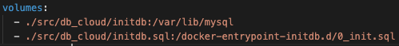
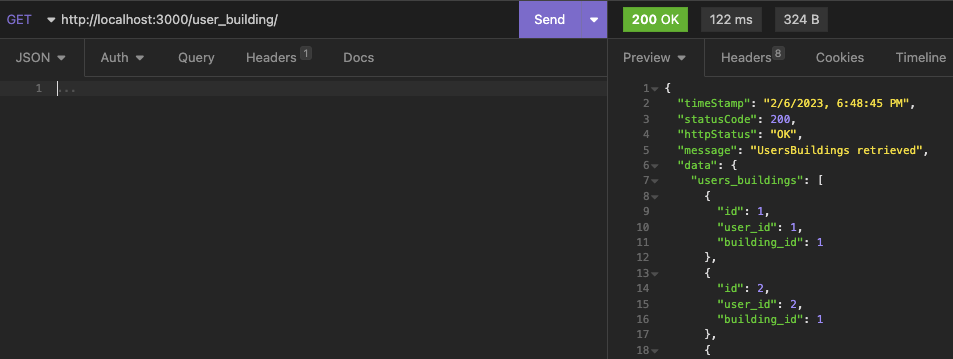
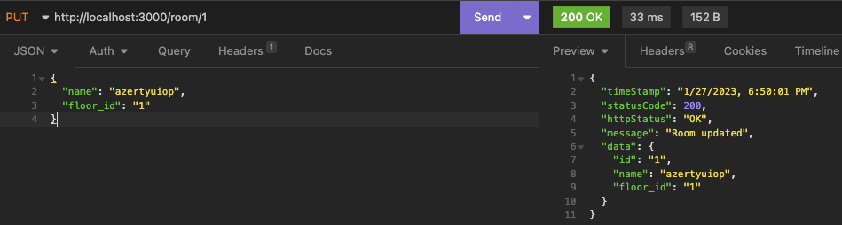

# API distante

# Docker database cloud - MySQL / Node

Type d’image : node:alpine

**Lancement des containers Docker Cloud**

**1 -** Aller dans l’arborescence **./Airlux/cloud/src/api_cloud** du dossier ;

**2 -** Installer le dossier node_module. Pour cela dans un invite de commande lancer la commande : `npm install` ;

**3 -** Lancer le docker compose :

- Linux seulement: Installer Docker Compose sur votre PC: `sudo curl -L "https://github.com/docker/compose/releases/download/1.23.2/docker-compose-$(uname -s)-$(uname -m)" -o /usr/bin/docker-compose && sudo chmod +x /usr/bin/docker-compose`

    Depuis **./Airlux/cloud :** `docker-compose up -d` ;
    
**4 -** Vérifier le lancement de l’API cloud :

- db_cloud : S’assurer de la création des tables. Attendre le lancement du serveur MySQL sur le port 3306
- api_cloud : S’assurer du lancement de l’API avec la mention : ‘Server is running on port :: 3000’

**Arborescence du dossier cloud**

Il est scindé en deux grandes parties :

- les **docker_files** qui nous permettent de définir les containers Docker pour nos usages.
- les fichiers **src**, qui contiennent les fichiers sources de de l’api d’un coter et des fichier pour l’initialisation de notre base de donnée SQL.

Lors de la création de notre Docker compose ils sont copiés dans le volume du container comme suit :

Container db_cloud :

Container api_cloud :

**Accés à la base de données**

Pour accéder à la base de données, rendez-vous dans le terminal du docker db_cloud :

- connectez vous avec : use : `mysql -u root -p` mot de passe : `letmein`
- de là il est possible de manager votre base de données.

**Points bloquants**

Réinitialisation de la Base de données : 

- Lors de l’utilisation de votre Base de données, il se peut que pour une raison quelconque vous deviez réinitialiser votre base de donnée. Pour cela il est impératif de supprimer les données créées lors de la construction de votre container.
- Pour cela rendez vous dans **./Airlux/cloud/src/db_cloud**
- Ici se trouve l’initialisation de votre base de donnée, construite à l’aide du fichier **initdb.sql**.
- Si le dossier **initdb** est présent, supprimez le entièrement.
- Ensuite suivez le processus de lancement du **Docker compose cloud**

**Outil pour exploiter l'API**

**Insomnia**

Insomnia permet de réaliser des requêtes sur l’API de façon simplifiée.

Il suffit de choisir :

- Le type de requête GET/PUT/DELETE/POST
- D’ajouter une adresse http : http://localhost:3000/….
- Dans le cas d’un POST/PUT : Sélectionner un fichier JSON et ajouter les informations requises à envoyer à la DB.

